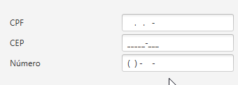

# MaskFilter
A TextFormatter.Change implementation to format user input in TextField without create a TextInputControl's subclass.

The lack of JavaFX's native textfield mask formatter took me to create a custom implementation able to use the same javax.swing.text.MaskFormatter's approach.

Eg.:

````Java
  TextField myTextField = new TextField();
  myTextField.setTextFormatter(new TextFormatter(new MaskFilter("##/##/####")));
````

A execution example below:



Feel free to open a issue if necessary. Fixes and improvement will be pushed as soon as possible.

Current version: **0.1-Snapshot**
